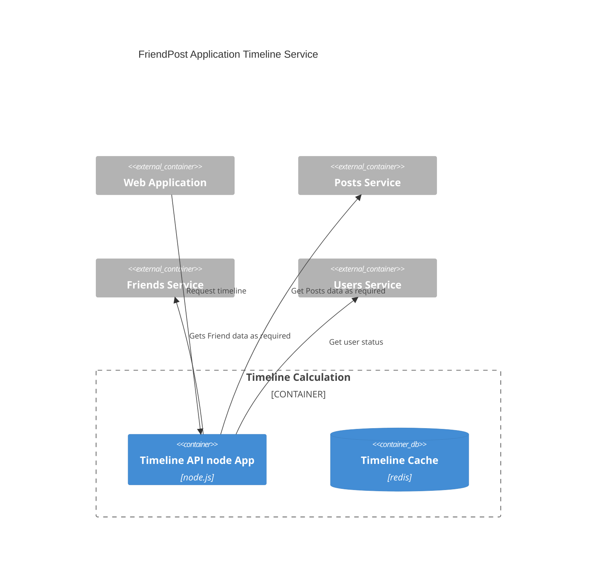

# timeline-spec
Spec file of Timeline

## Tech Stack

The Timeline service of the FriendPost application will be implemented using node and Redis.

## C4 Container Diagram

```mermaid
C4Container
title FriendPost Application Timeline Service

Container_Boundary(timelineservice, "Timeline Calculation") {
    Container(nodeapp, "Timeline API node App","node.js")
    ContainerDb(timelinecache, "Timeline Cache", "redis")
}

Container_Ext(webapp,"Web Application")
Container_Ext(postsservice,"Posts Service")
Container_Ext(friendsservice,"Friends Service")
Container_Ext(usersservice,"Users Service")

Rel(webapp, nodeapp, "Request timeline")
Rel(nodeapp, usersservice,"Get user status")
Rel(nodeapp, friendsservice, "Gets Friend data as required")
Rel(nodeapp, postsservice, "Get Posts data as required")

UpdateRelStyle(webapp, nodeapp, $offsetY = "-40")
UpdateRelStyle(nodeapp, usersservice, $offsetX="50", $offsetY = "-40")
UpdateRelStyle(nodeapp, friendsservice, $offsetY="-50")
UpdateRelStyle(nodeapp, postsservice, $offsetY="-40")
```
